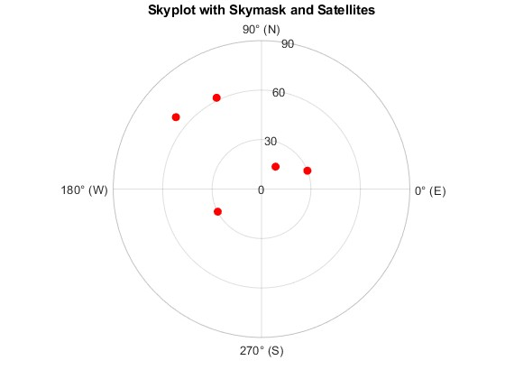

# AAE6102 Assignment 2

Model: ChatGPT 4o  
Comment: It is more logical and greater for comparison and conclusion in English contexts.

## Task 1: Differential GNSS Positioning

### Prompt:
Assume you are an expert in GNSS technology and its application in smartphone navigation. I want to compare the pros and cons of the following GNSS techniques: Differential GNSS (DGNSS), Real-Time Kinematic (RTK), Precise Point Positioning (PPP), and PPP-RTK. Please provide a detailed comparison from multiple perspectives, including:

- **Principles and Mechanisms**: Explain the underlying principles of each technique. How do they function, and what are the key differences in their operational mechanisms?
- **Accuracy and Precision**: Compare the accuracy and precision levels achievable with each technique. How do these techniques perform in terms of positional accuracy, especially in challenging environments like urban canyons?
- **Synchronization and Latency**: Discuss each technique's synchronization requirements and latency issues. How do these factors affect real-time navigation and user experience on smartphones?
- **Infrastructure Requirements**: Analyse the infrastructure needed to support each technique. Consider factors such as the availability of base stations, network connectivity, and any additional hardware or software requirements.
- **Interference and Signal Robustness**: Evaluate how each technique handles interference and signal degradation, particularly in environments with high multipath effects or signal obstructions.
- **Cost and Accessibility**: Consider the cost implications and accessibility of each technique for everyday smartphone users. Are there any barriers to widespread adoption?
- **Integration with Smartphones**: Discuss the ease of integration of each technique with current smartphone technology. Are there any compatibility issues or technological limitations?
- **Use Cases and Applications**: Provide examples of practical applications for each technique in smartphone navigation. How do they enhance user experience in different scenarios, such as driving, walking, or cycling?

### Contents:

When comparing Differential GNSS (DGNSS), Real-Time Kinematic (RTK), Precise Point Positioning (PPP), and PPP-RTK in the context of smartphone navigation, we can examine these techniques from several perspectives.

1. **Principles and Mechanisms**:
   - **DGNSS** improves standard GNSS by using reference stations to transmit correction signals that compensate for errors in satellite data, such as ionospheric and tropospheric delays. These corrections improve positioning accuracy but require access to a nearby reference station or network.
   - **RTK** uses carrier phase measurements of GNSS signals, offering centimeter-level precision. It requires a base station or a correction service that continuously provides real-time correction data, making it highly accurate but complex.
   - **PPP** operates by using precise satellite orbit and clock data to correct positioning, offering high accuracy, especially in post-processing. Real-time PPP is more challenging and computationally intensive but can achieve high accuracy in remote areas.
   - **PPP-RTK** combines the best of both, providing real-time corrections like RTK with the global coverage of PPP, offering high-precision positioning without the need for nearby base stations.

2. **Accuracy and Precision**:
   - **DGNSS** provides 1-3 meter accuracy, suitable for general smartphone navigation but not for precision tasks like autonomous driving.
   - **RTK** delivers centimeter-level accuracy, making it ideal for high-precision applications like surveying or autonomous vehicles.
   - **PPP** offers sub-meter to centimeter accuracy but struggles with real-time performance, as post-processing is typically needed for high-precision results.
   - **PPP-RTK** combines centimeter-level accuracy with real-time corrections, making it suitable for dynamic applications like autonomous driving or high-precision navigation.

3. **Synchronization and Latency**:
   - **DGNSS** involves minimal synchronization, with corrections transmitted from reference stations. Latency is low, but it may not support dynamic applications requiring real-time updates.
   - **RTK** requires synchronization between the base station and the mobile device. It has very low latency, providing real-time positioning updates ideal for dynamic environments.
   - **PPP** generally has higher latency, especially for real-time corrections. It’s not optimal for real-time navigation but is suitable for high-accuracy post-processing.
   - **PPP-RTK** offers low latency, combining real-time updates and high precision, making it ideal for fast-moving applications like autonomous vehicles.

4. **Infrastructure Requirements**:
   - **DGNSS** needs a network of reference stations for corrections. Smartphones can access these corrections via mobile networks, but infrastructure availability may vary by location.
   - **RTK** requires a base station or access to an RTK network. A constant communication link (e.g., 4G/5G) is necessary for real-time corrections, which can be expensive and may not be available everywhere.
   - **PPP** doesn’t require local infrastructure, relying on satellite-based corrections or cloud services. However, real-time PPP requires high computational power and internet connectivity.
   - **PPP-RTK** also needs a reliable communication link and access to satellite-based correction services. It combines high infrastructure demands from both RTK and PPP.

5. **Interference and Signal Robustness**:
   - **DGNSS** is susceptible to interference in urban canyons and areas with poor satellite visibility. Its performance degrades in environments with high multipath effects.
   - **RTK** is highly sensitive to signal degradation, particularly in complex environments where line-of-sight to satellites is obstructed.
   - **PPP** is more robust to local interference, as it doesn’t rely on local reference stations, but still needs good satellite visibility.
   - **PPP-RTK** benefits from the global corrections of PPP and the real-time processing of RTK, making it more resilient to interference than RTK alone.

6. **Cost and Accessibility**:
   - **DGNSS** is relatively low-cost and accessible, with many applications available for smartphone navigation. It’s suitable for everyday users.
   - **RTK** is expensive due to the need for base stations and specialized hardware, limiting its accessibility for regular consumers.
   - **PPP** is cheaper in terms of infrastructure, but the computational power required for real-time performance may limit its use in smartphones.
   - **PPP-RTK** is the most expensive and complex, requiring both real-time data transmission and high-precision hardware.

7. **Integration with Smartphones**:
   - **DGNSS** is the easiest to integrate into smartphones, using existing GNSS receivers and network connections for corrections.
   - **RTK** requires additional hardware (RTK receivers) and network connectivity, which may not be easily integrated into smartphones.
   - **PPP** can be integrated with smartphones using cloud processing, but real-time functionality is limited due to computational demands.
   - **PPP-RTK** faces similar integration challenges as RTK, with high infrastructure and processing requirements.

8. **Use Cases and Applications**:
   - **DGNSS** enhances navigation for general users, improving accuracy in outdoor environments for driving, walking, and cycling.
   - **RTK** is ideal for autonomous driving, high-precision surveying, or drone navigation, where centimeter-level accuracy is required.
   - **PPP** is used in remote navigation or geospatial applications where post-processing is acceptable, but real-time navigation is not the primary need.
   - **PPP-RTK** is perfect for autonomous vehicles and precision navigation in urban environments that require both high precision and real-time updates.

### Conclusion

For **smartphone navigation**, **DGNSS** provides accessible and sufficient accuracy for everyday users. **RTK** and **PPP-RTK** are better suited for high-precision, professional applications, but their high infrastructure demands and costs limit widespread use in consumer smartphones. **PPP** offers high accuracy but is better suited for post-processing applications rather than real-time navigation on smartphones.

## Task 2: GNSS in Urban Areas

Based on satEA and satAZ, we have drawn the mask plots as follows:

The following MATLAB code framework was implemented to process satellite visibility data and improve positioning accuracy. Each step in the process is outlined below, along with the corresponding code in `Assign2_Task2.m`.

## Step 1: Data Initialization and Setup
- **Extract actual satellite elevation (satEA) and azimuth (satAZ) angles** from the provided GNSS solutions.
- **Define theoretical satellite elevation angles** (`theoretical_elevation`) for various azimuth intervals based on the skymask.
- **Set the elevation threshold** (`elevation_threshold`) to filter out satellites with elevations below a certain value.

## Step 2: Initialize Visibility and Data Storage
- **Create a logical array `visible`** initialized to `false`, assuming initially that no satellites are visible.
- **Initialize an array `angle_diff`** to store the difference between the actual and theoretical elevation angles for each satellite.

## Step 3: Loop Through Each Satellite to Determine Visibility
- For each satellite:
  - Retrieve its **azimuth (`az`)** and **elevation (`ea`)**.
  - Find the **azimuth interval** to which the satellite belongs.
  - **Interpolate the theoretical elevation angle** for the given azimuth.
  - **Calculate the difference** between the actual and theoretical elevation angles.
  - Check if the satellite's **elevation is greater than or equal** to the theoretical elevation, marking it as visible if the condition is met.

## Step 4: Sort and Remove Satellites with Large Elevation Angle Differences
- **Identify the satellites that are invisible** (those with large differences between actual and theoretical elevation).
- **Sort the invisible satellites** by the magnitude of the elevation difference.
- **Gradually remove satellites** with the largest elevation differences until there are at least 4 visible satellites remaining.

## Step 5: Check for Sufficient Visible Satellites
- **Check if the number of visible satellites** is less than 4.
  - If fewer than 4 visible satellites are present, **issue a warning**, as accurate positioning cannot be solved.
  - If 4 or more satellites are visible, proceed with positioning calculations (assumed to be handled by a separate function).

## Step 6: Visualization of Visible and Invisible Satellites
- **Plot the azimuth and elevation** of visible satellites using a polar plot, represented with **red markers**.
- **Plot invisible satellites** (affected by multipath or blockage) with **blue markers**, providing a visual representation of satellite visibility.

### Calculation and Result Analysis

We introduce the skymask to improve the GNSS positioning performance by using the Urban data provided. The result is shown below:

## Task 3: RAIM (Receiver Autonomous Integrity Monitoring)

### The RAIM Algorithm Overview

The RAIM algorithm is based on the concept of using weighted least squares (WLS) to calculate the position of a receiver. The core idea is to assess the integrity of GNSS data by detecting faulty measurements and removing them iteratively, based on a defined probability of false alarm (PFA) and a chi-squared threshold.

The detailed MATLAB code for implementing the RAIM algorithm, including data initialization, variance calculations, weighted least squares solution, and satellite exclusion, can be found in the `Assign2_Task3.m` file.

### Steps

## Step 1: Data Initialization
- In this initial step, the predefined error variances for different GNSS signal components are set, including:
  - **Pseudorange correction error variance** (`sigma_UDRE`),
  - **Vertical ionospheric error variance** (`sigma_UIVE`),
  - **Signal-to-noise ratio error variance** (`sigma_SNR`),
  - **Multipath error variance at 45 degrees** (`sigma_m45`),
  - **Tropospheric error variance** (`sigma_trv`).

- The satellite elevation (`satEA`) and azimuth (`satAZ`) angles of the satellites are extracted from the GNSS data.
- The number of visible satellites (`N`) is also defined based on the available data.

## Step 2: Calculate Satellite Variance
- For each satellite, the total error variance (`sigma_i`) is calculated by combining the individual error components based on the satellite's elevation angle.
- This calculation accounts for various error sources such as ionospheric, multipath, and tropospheric effects, which vary with the elevation of the satellite.

## Step 3: Construct the Weight Matrix
- A diagonal weight matrix (`W`) is created, where each diagonal element corresponds to the error variance squared (`sigma_i^2`) for each satellite.
- This matrix is used in the weighted least squares (WLS) solution to weight the satellites' measurements according to their variances.

## Step 4: Set Probability of False Alarm (PFA) and Threshold Calculation
- The probability of false alarm (`PFA`) is set to a small value (e.g., \(10^{-7}\)), representing the desired confidence level for detecting faulty measurements.
- Based on this, the chi-squared threshold is calculated using the degrees of freedom (`N - 4`). The threshold will be used to determine if the weighted sum of squared errors (WSSE) is within an acceptable range.

## Step 5: Construct the Observation Matrix
- The observation matrix (`G`) is created to map the satellite measurements (pseudorange data) to the receiver's position in the X, Y, and Z directions.
- This matrix helps to establish the relationship between the satellite positions and the observed pseudoranges.

## Step 6: Weighted Least Squares Solution
- The weighted least squares solution is calculated to estimate the receiver's position by solving for the position vector `x` using the formula:

  \[
  x = \left( (G^T W G)^{-1} G^T W y \right)
  \]

- This step uses the observation matrix (`G`) and the weight matrix (`W`) to minimize the error in the position solution.

## Step 7: Calculate Weighted Sum of Squared Errors (WSSE)
- The weighted sum of squared errors (WSSE) is calculated to quantify the discrepancy between the observed pseudoranges and the predicted measurements based on the estimated position.
- If the WSSE exceeds a predefined threshold, it indicates potential faulty measurements that need to be addressed.

## Step 8: Remove Satellites with Large Contributions
- If the WSSE exceeds the threshold, satellites with the largest residual contributions are identified and removed.
- This step ensures that only reliable satellites contribute to the final position solution. The process repeats until at least 4 satellites remain.

## Step 9: Chi-Squared Threshold Calculation Function
- The chi-squared threshold is calculated using the chi-squared distribution based on the number of satellites and the false alarm probability (PFA).
- This threshold is used to assess whether the position solution is statistically valid and to exclude outliers (faulty measurements).

## Task 4: Low Earth Orbit (LEO) Satellites

### Prompt:
Assume you are an expert in satellite navigation systems. I want to explore the difficulties and challenges associated with using Low Earth Orbit (LEO) communication satellites for GNSS navigation. Please provide a detailed discussion covering the following aspects:
- **Orbital Characteristics**: Explain the differences between LEO satellites and traditional GNSS satellites in terms of their orbital altitudes, velocities, and coverage areas. How do these characteristics impact navigation capabilities?
- **Signal Propagation and Coverage**: Discuss the challenges related to signal propagation from LEO satellites. Consider factors such as signal strength, coverage continuity, and the impact of atmospheric conditions on signal quality.
- **Satellite Constellation and Density**: Analyze the requirements for a dense constellation of LEO satellites to achieve global navigation coverage. What are the logistical and technical challenges in deploying and maintaining such a constellation?
- **Timing and Synchronization**: Evaluate the difficulties in achieving precise timing and synchronization necessary for accurate navigation using LEO satellites. How do these challenges compare to those faced by traditional GNSS systems?
- **Interference and Multipath Effects**: Consider the potential for increased interference and multipath effects due to the lower altitude of LEO satellites. How might these issues affect navigation accuracy and reliability?
- **Infrastructure and Cost**: Discuss the infrastructure needed to support LEO-based navigation systems, including ground stations and user equipment. What are the cost implications of developing and maintaining such systems?
- **Technological Integration**: Explore the challenges of integrating LEO satellite navigation capabilities with existing GNSS technology and devices. Are there compatibility issues or technological hurdles to overcome?
- **Regulatory and Operational Challenges**: Consider the regulatory and operational challenges associated with using LEO satellites for navigation, including spectrum allocation and international cooperation.

### Contents:

Using Low Earth Orbit (LEO) communication satellites for GNSS navigation presents several unique challenges compared to traditional GNSS systems, which are typically based on Medium Earth Orbit (MEO) satellites. Below is a detailed discussion of the difficulties and challenges associated with LEO satellites for GNSS navigation:

1. **Orbital Characteristics**:
   - **Altitude and Velocity**:  
     LEO satellites typically orbit at altitudes between 500 km to 2,000 km, much lower than the 20,000 km to 24,000 km altitudes of traditional GNSS satellites. This lower altitude leads to higher orbital velocities—around 7.6 km/s compared to 3.9 km/s for MEO satellites.
   
   - **Impact on Navigation**:  
     The lower altitude and faster velocity of LEO satellites mean that they have a shorter orbital period (around 90-120 minutes). This leads to frequent satellite movement across the sky, which can result in coverage gaps as LEO satellites quickly move out of range. Additionally, their limited coverage area (a few hundred kilometers) requires a dense constellation for continuous global coverage, unlike MEO satellites which can cover broader areas due to their higher altitude.

2. **Signal Propagation and Coverage**:
   - **Signal Strength**:  
     LEO satellites face challenges related to signal strength due to their lower altitude. The shorter distance to the user means that LEO signals have higher signal attenuation from atmospheric absorption, particularly in regions with adverse weather conditions such as rain, snow, or clouds.
   
   - **Coverage Continuity**:  
     LEO satellites have limited line-of-sight coverage. As they orbit quickly, a satellite may be visible for only a few minutes, leading to gaps in coverage. To achieve continuous coverage, a very large number of satellites must be deployed, and even then, shadowing effects from buildings or natural terrain can cause signal dropouts.

3. **Satellite Constellation and Density**:
   - A dense constellation is essential to ensure global coverage with LEO satellites. This requires the deployment of hundreds or even thousands of satellites. Organizing such a large number of satellites, especially ensuring they are placed in the correct orbital planes, poses significant logistical and technical challenges.
   
   - **Satellite Deployment**:  
     Launching and maintaining a dense constellation incurs high costs. Additionally, the life span of LEO satellites is shorter than that of MEO satellites (typically around 5-7 years), leading to the challenge of constant replenishment and maintenance.

4. **Timing and Synchronization**:
   - **Precise Timing** is crucial for GNSS navigation. LEO satellites, due to their low altitude, experience greater time dilation effects relative to ground stations, making synchronization more difficult than with MEO satellites. These effects must be accurately compensated for in real-time.

   - **Comparison to MEO**:  
     MEO satellites experience smaller time dilation effects and can provide more stable and synchronized signals. The complexity of synchronizing a dense, rapidly moving LEO constellation is a major challenge.

5. **Interference and Multipath Effects**:
   - LEO satellites are more susceptible to interference and multipath effects due to their low altitude. Since the signals have to travel through more of the Earth's atmosphere, this increases the potential for atmospheric interference (e.g., ionospheric and tropospheric delays). The lower altitude also makes the system more vulnerable to reflections off buildings, mountains, and other obstacles, leading to multipath errors.
   
   - These effects can significantly degrade the accuracy and reliability of navigation, especially in urban environments or areas with dense vegetation.

6. **Infrastructure and Cost**:
   - **Ground Stations**:  
     LEO satellites require multiple ground stations to maintain continuous communication and synchronization. Unlike MEO satellites, which only require a few ground stations due to their wide coverage, LEO satellites require a much more extensive ground infrastructure to track and communicate with them as they pass overhead.
   
   - **Cost Implications**:  
     Building, launching, and maintaining a dense constellation of LEO satellites is highly cost-intensive, not only for initial deployment but also for the frequent replacements of satellites due to their shorter operational lifetimes.

7. **Technological Integration**:
   - Integrating LEO satellite navigation into existing GNSS technology presents several compatibility issues. Current GNSS receivers are designed to work with MEO satellites, which transmit at higher altitudes and at different frequencies. Transitioning to a LEO-based system requires the development of new receivers and algorithms capable of processing signals from satellites that move quickly across the sky.
   
   - **Power and Size**:  
     LEO satellite navigation requires significant power and miniaturization of technology in consumer devices, which could increase the cost and size of smartphones or other GNSS-enabled devices.

8. **Regulatory and Operational Challenges**:
   - **Spectrum Allocation**:  
     As LEO satellites operate at lower altitudes, they need dedicated spectrum allocation for their signals. Coordination with global regulatory bodies such as the International Telecommunication Union (ITU) is essential to avoid interference with other communication systems.
   
   - **International Cooperation**:  
     Given the global nature of satellite constellations, international cooperation is crucial for the management of the space environment, avoiding satellite collisions, and ensuring that LEO systems are interoperable with traditional GNSS systems.

### Conclusion

Using LEO satellites for GNSS navigation presents several challenges related to orbital characteristics, signal propagation, timing synchronization, and the need for a dense constellation. These challenges necessitate significant investments in infrastructure, technology development, and international cooperation. While LEO-based systems can potentially offer advantages in terms of higher accuracy and coverage flexibility, overcoming these hurdles is key to realizing their full potential for global navigation.

## Task 5: Remote Sensing

### Prompt:

Assume you are an expert in GNSS technology and its applications in remote sensing. Focus on GNSS Reflectometry (GNSS-R) and provide a detailed discussion on the following aspects:

- **Technique Overview**: Describe the basic principles of GNSS-R and how it utilizes GNSS signals for remote sensing.
- **Applications and Advantages**: Discuss specific applications of GNSS-R in remote sensing and its advantages compared to traditional remote sensing methods.
- **Data Collection and Processing**: Explain the process of data acquisition and processing in GNSS-R, including the main challenges and solutions.
- **Accuracy and Resolution**: Evaluate the accuracy and resolution of GNSS-R and how these factors impact the quality and reliability of remote sensing data.
- **Environmental and Atmospheric Monitoring**: Explore the role of GNSS-R in environmental and atmospheric monitoring, providing examples of measurable phenomena or parameters.
- **Technological Integration**: Discuss the integration of GNSS-R with existing remote sensing technologies and systems, noting any compatibility issues or technological advancements that enhance its effectiveness.
- **Challenges and Limitations**: Identify the challenges and limitations faced by GNSS-R, such as signal interference, data processing complexity, and operational constraints.

### Contents:

1. **Technique Overview**

   GNSS Reflectometry (GNSS-R) is a remote sensing technique that uses signals from existing Global Navigation Satellite System (GNSS) satellites, such as GPS, Galileo, and GLONASS, to gather environmental data. The principle behind GNSS-R is simple: when GNSS signals reach the Earth's surface, some of the signals are reflected back toward the satellite. A receiver on the ground or aboard a satellite detects both the direct and reflected signals, and by analyzing the time delay and Doppler shift between these signals, the physical properties of the reflecting surface (such as ocean roughness, soil moisture, or vegetation type) can be inferred. This non-invasive approach offers significant potential for monitoring Earth’s surface, especially when traditional remote sensing methods are impractical.

2. **Applications and Advantages**

   GNSS-R is particularly useful in environmental monitoring and offers advantages over traditional methods like radar or optical imaging. Key applications include:

   - **Soil Moisture Monitoring**: GNSS-R can measure soil moisture by analyzing the reflected GNSS signals, which are affected by water content in the soil. This is useful for agriculture and drought monitoring.

   - **Ocean Surface Monitoring**: By detecting variations in the reflected signal from the ocean's surface, GNSS-R is effective in monitoring sea surface roughness, ocean wind speeds, and wave heights, crucial for weather prediction and climate modeling.

   - **Vegetation and Forest Monitoring**: GNSS-R can detect changes in vegetation, providing data on forest cover, health, and biomass. The reflection of GNSS signals varies with vegetation type and density, allowing for continuous tracking of vegetation changes.

   - **Ice and Snow Cover**: GNSS-R helps in tracking snow depth and ice coverage in polar regions, providing data essential for understanding climate change and its impact on global sea levels.

   The key advantages of GNSS-R over traditional remote sensing methods include the ability to operate in all weather conditions, day or night, without the need for direct sunlight, and the low cost since it uses existing GNSS signals.

3. **Data Collection and Processing**

   In GNSS-R, data is collected through a receiver that detects both the direct and reflected GNSS signals. The main steps include:

   - **Signal Reception**: The receiver measures the direct signal from the satellite and the reflected signal from the Earth's surface.

   - **Signal Comparison**: The time delay and Doppler shift between the direct and reflected signals are analyzed to infer the characteristics of the reflecting surface (e.g., moisture content or roughness).

   - **Data Interpretation**: The collected data is processed using correlation techniques and statistical models to extract surface parameters.

   Challenges in data collection and processing include the weak signal strength of the reflected signals and the difficulty in separating the direct signal from the reflected one. Advanced signal processing techniques, such as correlation analysis and multi-frequency receivers, are used to mitigate these challenges.

4. **Accuracy and Resolution**

   GNSS-R provides moderate accuracy and resolution. The accuracy typically ranges from 10-20 cm for surface measurements such as soil moisture, depending on the surface type and environmental conditions. For ocean monitoring, GNSS-R can achieve 1-2 cm resolution in detecting sea surface roughness.

   The resolution of GNSS-R is limited by the wide footprint of the reflected signal, which is usually several kilometers. Therefore, while GNSS-R is effective for regional and large-scale monitoring, it lacks the high spatial resolution of optical or radar sensors.

5. **Environmental and Atmospheric Monitoring**

   GNSS-R plays a crucial role in environmental and atmospheric monitoring. It is particularly valuable in:

   - **Soil Moisture Measurement**: GNSS-R provides real-time data on soil moisture levels, helping farmers manage irrigation and monitor drought conditions.

   - **Oceanography**: By measuring sea surface roughness and ocean wind speeds, GNSS-R helps track ocean conditions, crucial for weather forecasting, storm tracking, and climate studies.

   - **Vegetation Monitoring**: It provides insights into vegetation health, biomass, and density, offering valuable data for agriculture, deforestation studies, and ecosystem health.

6. **Technological Integration**

   GNSS-R can be easily integrated into existing remote sensing systems, especially in satellite-based Earth observation missions. Existing GNSS infrastructure (such as GPS satellites) provides a cost-effective platform for remote sensing, reducing the need for dedicated sensors.

   Compatibility with traditional remote sensing methods like radar and optical imagery can enhance GNSS-R’s effectiveness, allowing for a more comprehensive analysis of Earth’s surface. The integration of multi-frequency GNSS receivers and advanced data processing algorithms continues to improve its accuracy.

7. **Challenges and Limitations**

   Despite its advantages, GNSS-R faces several challenges:

   - **Signal Interference**: Reflected GNSS signals are weak, and interference from other sources, such as multipath reflections in urban areas or dense forests, can degrade the quality of the data.

   - **Complex Data Processing**: Separating direct and reflected signals requires advanced algorithms and computational resources, which can complicate data processing.

   - **Limited Spatial Resolution**: Due to the wide footprint of reflected signals, GNSS-R lacks the high spatial resolution of traditional radar or optical methods.

**Conclusion**

In summary, GNSS-R is a versatile and cost-effective tool for environmental and atmospheric monitoring, offering unique benefits over traditional remote sensing methods. While challenges such as signal interference and resolution limitations exist, continued technological innovations will improve its applications and impact in remote sensing.

